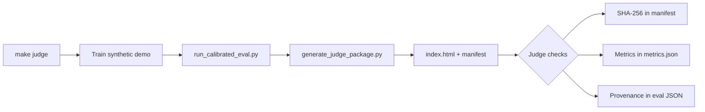

# Judge Experience Guide

**Goal:** A judge clones the repository, runs **one command**, views compelling outputs, verifies claims, and understands real-world value in **under five minutes**.

---

## Entry Path

```
Clone → pip install → make judge → open index.html
```

| Step | Time | Action |
|------|------|--------|
| 0 | 30s | Read this file or README "Judge Quick Start" |
| 1 | 2–4 min | `make judge` (train + eval + evidence) |
| 2 | 1 min | Open `evidence/judge_package/index.html` |
| 3 | 1 min | Optional: `streamlit run demo_ui/app.py` → Judge Verification |

**Fast path (pre-generated evidence already in repo):**

```bash
open evidence/judge_package/index.html   # or xdg-open on Linux
```

If the HTML is present from a prior `make judge`, judges can inspect immediately without running Python.

---

## Commands

### Primary (recommended)

```bash
python -m venv .venv && source .venv/bin/activate
pip install -r requirements.txt
make judge
```

Equivalent:

```bash
bash scripts/judge_verify.sh
```

### Production benchmark (optional, requires release tarball)

```bash
export SVAMITVA_ARTIFACTS_URL="https://<host>/svamitva_production_benchmark.tar.gz"
bash scripts/fetch_artifacts.sh
SVAMITVA_CONFIG_PATH=config/platform_config.v1.json python run_calibrated_eval.py --require-bias
bash scripts/verify_production_benchmark.sh
```

### Regenerate evidence only (skip retrain if checkpoints exist)

```bash
make judge-package
```

---

## Expected Outputs

### Terminal (after `make judge`)

```
Full-raster FG mIoU (synthetic): 0.1989
Git SHA: <12-char>
Manifest: evidence/judge_package/verification_manifest.json
Eval artifact: outputs/calibrated_eval_results.json
file://.../evidence/judge_package/index.html
```

### Files

| Path | Purpose |
|------|---------|
| `evidence/judge_package/index.html` | **Open first** — visual report |
| `evidence/judge_package/metrics.json` | GT vs prediction IoU per class |
| `evidence/judge_package/verification_manifest.json` | SHA-256 of every file in package |
| `evidence/judge_package/survey_intelligence.json` | Decision-support output |
| `evidence/judge_package/overlays/01–06_*.png` | Input, GT, pred, overlay, confidence, error |
| `outputs/calibrated_eval_results.json` | Full eval pipeline with provenance |

### Key metrics (synthetic verification benchmark)

| Metric | Expected (approx.) | Scope |
|--------|-------------------|-------|
| FG mIoU | 0.19–0.23 | Full 1024×1024 synthetic ortho |
| Built-Up IoU | 0.75–0.85 | Dominant learnable class |
| Road / Water / Bridge IoU | ~0.0 | Thin/small regions on tiny synthetic set |

**Important:** These are **pipeline verification** numbers, not production village-scale claims. Production metrics require the release tarball path above.

---

## Screenshots / Artifacts

### HTML evidence pack (`index.html`)

Contains embedded base64 images (no external dependencies):

1. **Input RGB** — center patch of synthetic orthomosaic  
2. **Ground Truth** — vector-rasterized labels  
3. **Prediction** — ensemble model output  
4. **Overlay** — alpha blend  
5. **Confidence** — max softmax probability heatmap  
6. **Error Map** — green=TP, red=FP, blue=FN  

### Overlay files (standalone PNG)

```
evidence/judge_package/overlays/
  01_input_rgb.png
  02_ground_truth.png
  03_prediction.png
  04_overlay.png
  05_confidence.png
  06_error_map.png
```

---

## Verification Flow



### Independent checks a judge can run

1. **Visual:** Open `index.html` — prediction should align with yellow built-up block in center patch.
2. **Cryptographic:** Compare `verification_manifest.json` SHA-256 hashes after regeneration.
3. **Numerical:** `cat evidence/judge_package/metrics.json | jq '.patch_verification.fg_miou'`
4. **Pipeline:** `cat outputs/calibrated_eval_results.json | jq '.provenance.git_sha'`
5. **Tests:** `make test` — 35+ tests, CI parity.

### What judges should NOT expect from clone-only

- Production FG mIoU ~0.39 on real SVAMITVA orthomosaics (requires `SVAMITVA_ARTIFACTS_URL`)
- Bridge class operational performance (explicitly IoU 0.0)

---

## Real-World Value (60-second narrative)

1. **Problem:** Village property surveys need automated extraction of roads, buildings, and water from drone orthomosaics.
2. **Solution:** This platform segments infrastructure, applies geospatial postprocessing, and produces a **survey intelligence report** (access, fragmentation, review zones).
3. **Proof:** HTML evidence pack shows the full chain from GeoTIFF → prediction → metrics → recommendations.
4. **Deploy:** `uvicorn production.api:app` exposes `/infer`, `/infer-tiff`, `/survey-report`.

---

## Friction Minimization Checklist

- [x] Single command: `make judge`
- [x] No manual checkpoint download for synthetic path
- [x] HTML works offline (embedded images)
- [x] Honest labeling of synthetic vs production metrics
- [x] SHA-256 manifest for tamper detection
- [ ] Production tarball URL (operator must host — see `scripts/package_production_release.sh`)

---

## Troubleshooting

| Issue | Fix |
|-------|-----|
| CUDA OOM | Runs on CPU; slower but works |
| `optimal_bias` wrong metrics | Re-run `python scripts/build_synthetic_fixtures.py` (writes zero bias) |
| Zero IoU in HTML | Ensure `make judge` completed; old packages used production bias on synthetic checkpoints |
| Missing checkpoints | `make judge` trains automatically |
