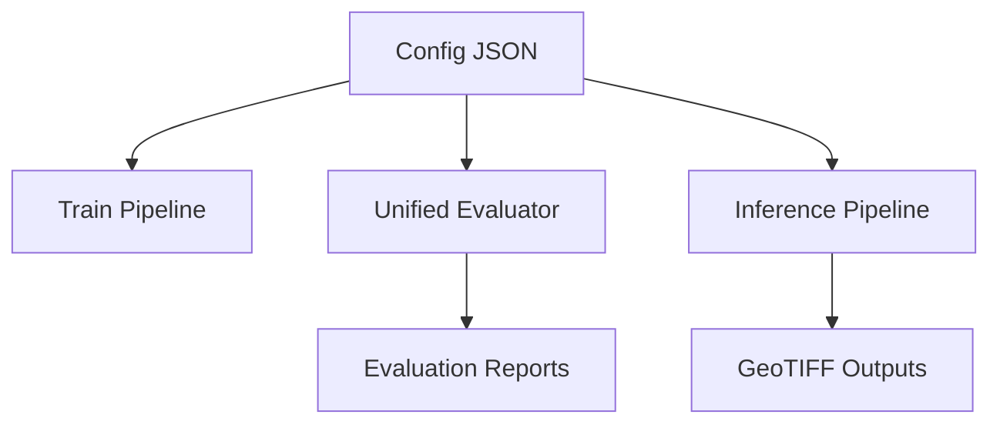

# Generated Architecture Snapshot

Source of truth: config/platform_config.v1.json  
Version: 1.0.0

## Classes
| ID | Name | Color RGB |
|---:|------|-----------|
| 0 | Background | [0, 0, 0] |
| 1 | Road | [255, 0, 0] |
| 2 | Bridge | [0, 0, 255] |
| 3 | Built-Up Area | [255, 255, 0] |
| 4 | Water Body | [0, 200, 255] |

## Dataset Splits
### Train TIFFs
- PINDORI MAYA SINGH-TUGALWAL_28456_ortho
- TIMMOWAL_37695_ORI
- BADETUMNAR_450157_BANGAPAL_450155_CHHOTETUMAR_450149_MOFALNAR_450150_ORTHO
- MURDANDA_450879_AWAPALLI_CHINTAKONTA_ORTHO
- KUTRU_451189_AAKLANKA_451163_ORTHO
- SAMLUR_450163_SIYANAR_450164_KUTULNAR_450165_BINJAM_450166_JHODIYAWADAM_450167_ORTHO

### Validation TIFFs
- 28996_NADALA_ORTHO
- NAGUL_450171_MADASE_450172_GHOTPAL_450137_ORTHO

## Training Defaults
- architecture: DeepLabV3Plus
- encoder_name: resnet50
- image_size: 768
- patches_per_image: 150
- batch_size: 4
- accumulation_steps: 8
- num_epochs: 80

## Evaluation Defaults
- batch_size: 8
- num_workers: 4
- max_val_patches: 500

## System Diagram

