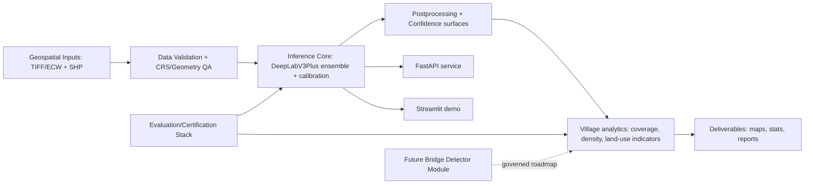

# Final System Architecture

Selected architecture: Option C (Hybrid geospatial intelligence platform)

## Why Option C
- Evidence shows production-grade strengths beyond a single segmentation model: evaluation certification PASS, GIS certification PASS, demo certification PASS, API readiness PASS, and 91.48% test coverage.
- Bridge segmentation is formally constrained by dataset signal and validated as non-operational in current scope.
- A hybrid platform framing maximizes judged value: deploy what is certified now (Road, Built-Up Area, Water Body) while explicitly structuring bridge as a governed future module.

## Final operational scope
- Operational classes: Road, Built-Up Area, Water Body.
- Non-operational class in current submission: Bridge segmentation.
- Bridge handling policy: transparent reporting + detector roadmap (future module), not hidden output claims.

## Architecture layers

## Evidence anchors
- Bridge constraint: outputs/bridge_impossibility/bridge_impossibility_proof.md
- Class-level outcome: outputs/bridge_campaign/final_bridge_recovery_report.md
- Evaluation consistency: outputs/recovery_reports/evaluation_certification.md
- Geospatial integrity: outputs/recovery_reports/gis_certification_report.md
- Demo readiness: outputs/recovery_reports/demo_certification_report.md and outputs/recovery_reports/demo_readiness_certification.md
- Production API readiness: outputs/recovery_reports/production_api_report.md
- Test reliability: outputs/recovery_reports/testing_coverage_report.md

## Architecture decision statement
- Submit a certified hybrid geospatial intelligence platform with operational Road/Built-Up/Water analytics, explicit bridge limitation disclosure, and a governance-backed detector roadmap.
