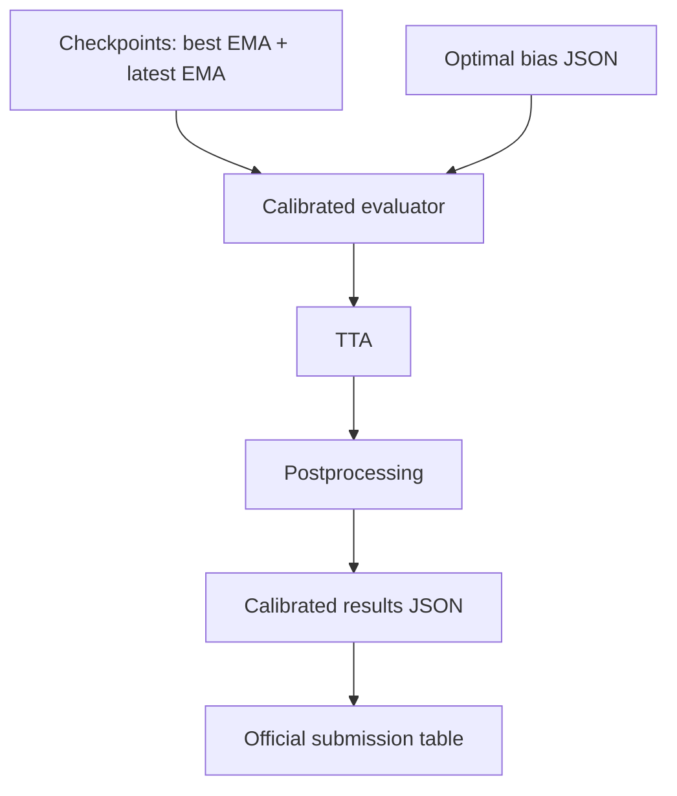

# Metric Lineage

## Canonical Lineage For Submission

Use only one metric lineage for board-facing claims:

1. `outputs/checkpoints/best_model.pth` + `outputs/checkpoints/latest_model.pth`
2. `outputs/optimal_bias.json`
3. `run_calibrated_eval.py`
4. `outputs/calibrated_eval_results.json`
5. `official_metrics_for_submission.md`

## Processing Graph

## Non-Submission Branches

- Legacy narrative documents, training logs, and experimental bridge campaign artifacts are historical or diagnostic branches.
- They are not valid for board-facing metric claims.

## Policy

- Any file with board-facing metrics must cite evaluator, checkpoint pipeline, calibration status, and generated artifact/date.
- If a metric does not trace to `outputs/calibrated_eval_results.json`, it is non-submission.
